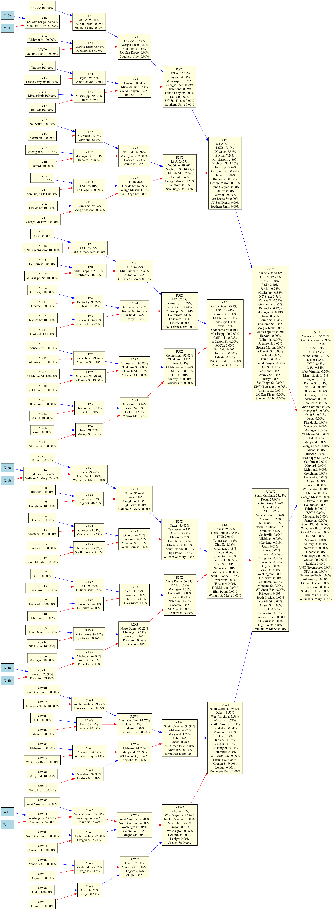

## 2025 Predictions

Finally! Choose two teams and a location for the game to be played!

<h2>Prediction Lookup</h2>

<select id="gender">
  <option value="m">Men</option>
  <option value="w">Women</option>
</select>

<label for="teamInput">Team 1:</label>
<input type="text" id="teamInput" placeholder="Team Name">
<label for="OppInput">Team 2:</label>
<input type="text" id="oppInput" placeholder="Opponent Team Name">
<button onclick="lookupPrediction()">Look Up</button>

<label for="location">Team 1 Location:</label>
<select id="location">
  <option value="home">Home</option>
  <option value="away">Away</option>
  <option value="neutral">Neutral</option>
</select>

What does that mean for 2025 March Madness? It means probabilities for teams progressing through the bracket and advancing to different stages in the tournament.

