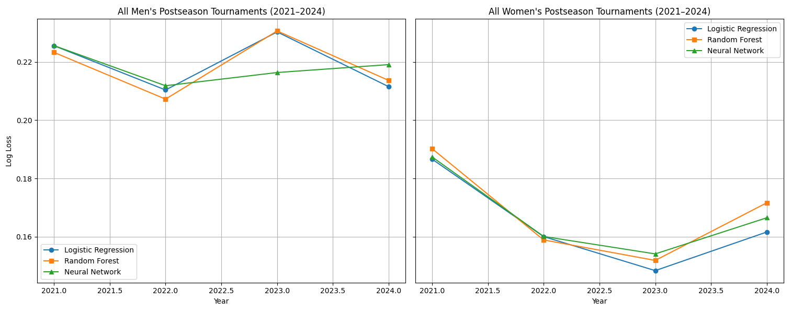

<!-- [Selecting a Model]({{ site.baseurl }}/selecting_a_model/) |  [Random Forest]({{ site.baseurl }}/random_forest/) |  [Neural Network]({{ site.baseurl }}/neural_network/) |  [Logistic Regression]({{ site.baseurl }}/logistic_regression/) |  [Backtesting]({{ site.baseurl }}/backtesting/) -->

With a set of features engineered to represent how teams create and prevent specific statistical outcomes, the next step was to choose a model capable of using these features to predict game results. I tested three different approaches: logistic regression, random forest, and a neural network. Each model used the predicted per-matchup statistics—such as estimated shooting percentages, expected turnover margins, and rebounding interactions—to generate win probabilities for each team. The logistic regression example scored highest using standard cross-validation, and changing the number of years in the training set led to only marginal improvements in any of the models. I had some qualms about my cross-validation because the ratings being fed into the models as features were produced using all regular season games from the training years, and since the features were created earlier in my pipeline than the dataset was split into training and test data, we could run into overfitting issues. Further, it's possible the model would not generalize from regular season games to tournament games when there are true win-or-go-home implications to every game.

Above are the graphs comparing the performance of each model on the past few years of NCAA tournament games. There are way too few postseason games to train a model using only this data, but it can help to sanity check the models and logistic regression still performed comparably to or better than the other more complicated models on these new games. For simplicity, speed, and interpretability I chose to proceed with the logistic regression model.
