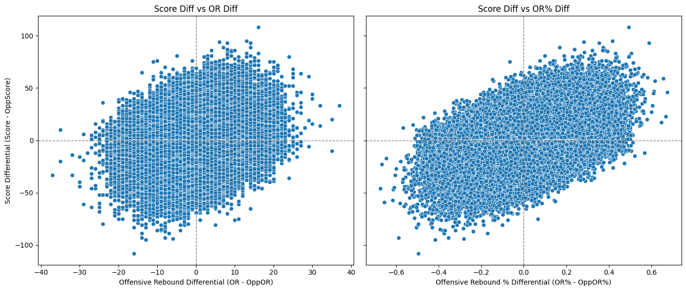
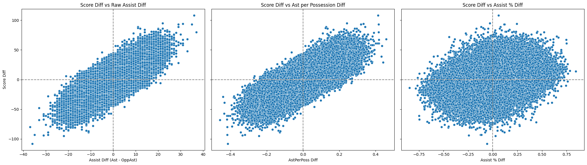
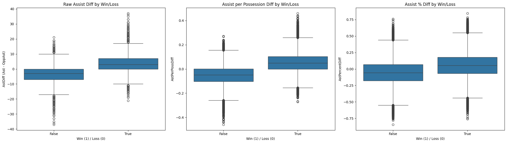

[Feature Engineering Home]({{ site.baseurl }}/feature_engineering/) | [Useful Metrics]({{ site.baseurl }}/useful_metrics/) | [Creation/Prevention]({{ site.baseurl }}/creation_prevention/) | [Matchup Features]({{ site.baseurl }}/matchup_features/)

In this project I begin with raw game statistics which can be found in boxscores, but I first do some investigation and feature engineering, using the context of college basketball in 2025 to make informed choices about what features should be included in model construction. The first thing I decided was that many of the counting statistics in every boxscore should be normalized for pace of play. A game that goes to triple overtime is likely to have high numbers of blocks by both teams, but that does not mean both teams had a good shot-blocking day. It would also have been reasonable to divide these statistics and some others by number of minutes played, but I made the decision that pace of play is something worth trying to predict. For a matchup in the future where I want to predict the outcome, I can feed in pace of play metrics for both teams as well as per-possession counting stats. The statistics I chose to normalize in this way are blocks, steals, turnovers, and fouls.

In a similar vein, I chose to use shooting percentages intead of raw counts of made shots, three pointers, and free throws. The primary goal here was to disentangle shooting success from number of possessions, and to do so in a way where success shooting twos does not reflect poorly on your ability to shoot threes and vice versa. If I were to have created features like "three pointers made per possession" then teams that frequently get to the free throw line would be unfairly awarded lower shooting numbers. I did add as a metric the percentage of a team's shots that were three pointers. I thought about adding something similar for attempting free throws but decided it was too correlated to opponent's fouls committed, and just included some variance (shooting fowls before/after fouls on the floor, missing the front end of a 1-1). From this section I ended up with field goal percent, three point percent, free throw percent, and percent of shots attempted that were threes.

Rebounding is central to game outcome but is difficult to separate from other aspects of the game. Missing shots leads to offensive rebounding opportunities and forcing misses leads to defensive rebounding opportunities, not to mention the fact that pace of play affects both in the same direction. The metric I chose to encapsulate a team's rebounding success is percent of missed shots converted into offensive rebounds. This turns rebounding into purely an offensive statistic, with the defensive piece coming into play when we start talking about limiting the opponent's offensive rebounding.

Finally, assists are also tricky because it is a passing metric that relies directly on a teammate's ability to take and make shots. I wanted a way to normalize assist numbers to reflect how good a team's passing performance was without pace of play or teammate shooting percentages influencing the result. I settled on assists per made basket, and while this is clearly not as predictive of game outcome as raw assists or even assists per possession, it still has some predictive power and should better distill the passing efficiency displayed in the game.

